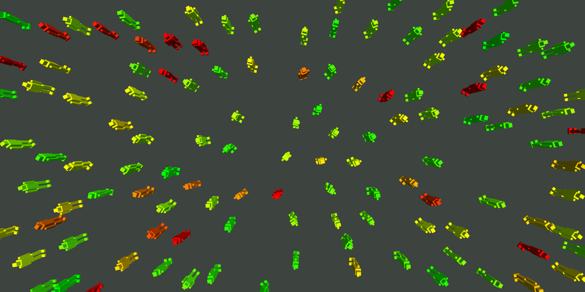

# Real-time Crowd Simulation in a Web Browser

This repository contains the source code of my third-year dissertation titled "Real-time Crowd Simulation in a Web Browser".

- To build, run `npm run build`
- To run the unit tests, run `npm run test`.

This software is subject to the following Copyrights and Licenses:

`Copyright © Oliver Wales 2021 - All Rights Reserved`
